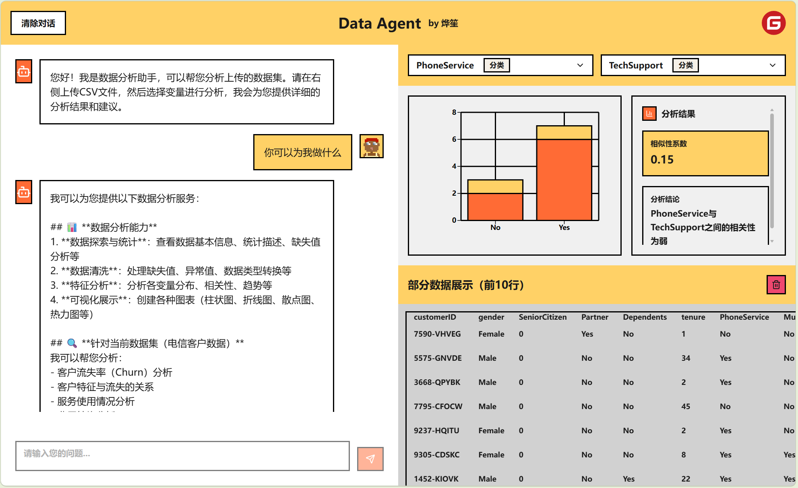
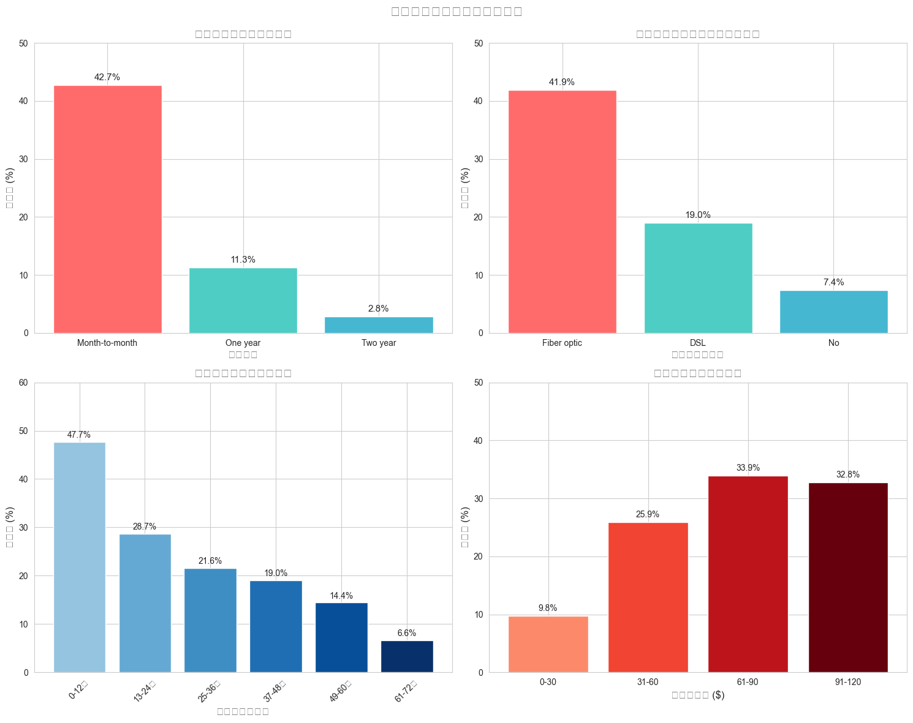

# Data Agent - AI 数据分析助手

一个基于 LangChain 1.1 和 React 的智能数据分析应用，支持 CSV 数据上传、AI 对话分析和数据可视化。



## 主要功能

### 数据管理

- **CSV 文件上传**：支持点击或拖拽上传 CSV 文件
- **数据预览**：自动显示数据前 10 行，支持列类型识别
- **智能预处理**：自动清理空行空列、类型推断、缺失值填充
- **数据持久化**：页面刷新后数据自动恢复

### AI 数据分析

- **流式对话**：基于 Server-Sent Events (SSE) 的实时流式响应
- **Python 代码执行**：Agent 可执行 Pandas 数据分析代码
- **图表生成**：支持使用 Matplotlib/Seaborn 生成可视化图表
- **动态上下文**：根据当前数据集自动更新 Agent 的 System Prompt

### 数据可视化

- **智能图表**：根据变量类型自动生成合适的图表
  - 离散 + 离散 → 堆叠柱状图
  - 连续 + 连续 → 散点图
  - 混合类型 → 分组柱状图
- **相关性分析**：点击变量快速计算相关系数
- **图表展示**：Agent 生成的图表自动显示在可视化面板



## 项目结构

```
Data Agent/
├── backend/                 # 后端服务
│   ├── src/
│   │   ├── agent.py        # LangGraph Agent 定义
│   │   ├── server.py       # FastAPI 服务器
│   │   ├── data_manager.py # 数据管理模块
│   │   ├── tools.py        # Agent 工具（Python执行、绘图）
│   │   └── state.py        # Agent 状态定义
│   ├── static/             # 静态文件（生成的图片）
│   ├── temp_data/          # 临时上传的数据文件
│   └── pyproject.toml      # Python 依赖配置
│
├── frontend/               # 前端应用
│   ├── src/
│   │   ├── components/     # React 组件
│   │   │   ├── Header.tsx           # 顶部导航栏
│   │   │   ├── ChatInterface.tsx    # AI 对话界面
│   │   │   ├── DataUpload.tsx       # 数据上传组件
│   │   │   ├── VisualizationPanel.tsx # 可视化面板
│   │   │   └── ui/                  # UI 组件库
│   │   ├── config/
│   │   │   └── api.ts      # API 配置
│   │   └── App.tsx         # 主应用组件
│   ├── public/             # 静态资源
│   └── package.json        # Node.js 依赖配置
│
└── README.md              # 项目说明文档
```

## 快速开始

### 前置要求

- Python 3.10+
- Node.js 18+
- DeepSeek API Key（在 [DeepSeek 官网](https://www.deepseek.com/) 获取）

### 安装步骤

#### 1. 配置后端

```bash
cd backend

# 安装依赖（需要先安装 uv，参考 https://uv.fan/w/installation）
uv sync

# 配置环境变量
# 在 backend 目录下创建 .env 文件
echo "DEEPSEEK_API_KEY=your_api_key_here" > .env
```

#### 2. 配置前端

```bash
cd frontend

# 安装依赖
npm install
```

### 启动服务

#### 启动后端

```bash
cd backend
uv run python -m src.server
```

后端服务将在 `http://localhost:8002` 启动。

#### 启动前端

```bash
cd frontend
npm run dev
```

前端应用将在 `http://localhost:5173` 启动（Vite 默认端口）。

### 访问应用

打开浏览器访问 `http://localhost:5173`，即可开始使用。

## 配置说明

### 后端配置

**环境变量**（`.env` 文件）：

```env
DEEPSEEK_API_KEY=your_deepseek_api_key
```

**API 端口**：默认 `8002`，可在 `server.py` 中修改

**数据存储**：

- 上传的文件保存在 `backend/temp_data/`
- 生成的图片保存在 `backend/static/images/`

### 前端配置

**API 地址**：在 `frontend/src/config/api.ts` 中配置后端地址

```typescript
export const API_BASE_URL = 'http://localhost:8002';
```

## 使用指南

### 1. 上传数据

- 点击右侧面板的"上传数据"区域，或直接拖拽 CSV 文件
- 上传成功后，数据预览会自动显示在前 10 行
- 系统会自动识别变量类型（离散/连续）

### 2. 分析数据

#### 方式一：可视化分析

- 在数据预览区域点击两个变量
- 系统自动计算相关性并生成合适的图表

#### 方式二：AI 对话分析

- 在左侧对话界面输入问题，例如：
  - "分析一下数据的整体情况"
  - "计算各列的平均值"
  - "绘制年龄和收入的散点图"
- Agent 会执行 Python 代码并返回结果
- 如果生成了图表，会自动显示在可视化面板

### 3. 查看结果

- **对话结果**：在左侧对话界面查看 AI 的分析结果
- **可视化图表**：在右上角可视化面板查看图表
- **生成图片**：Agent 生成的图片会显示在可视化面板
